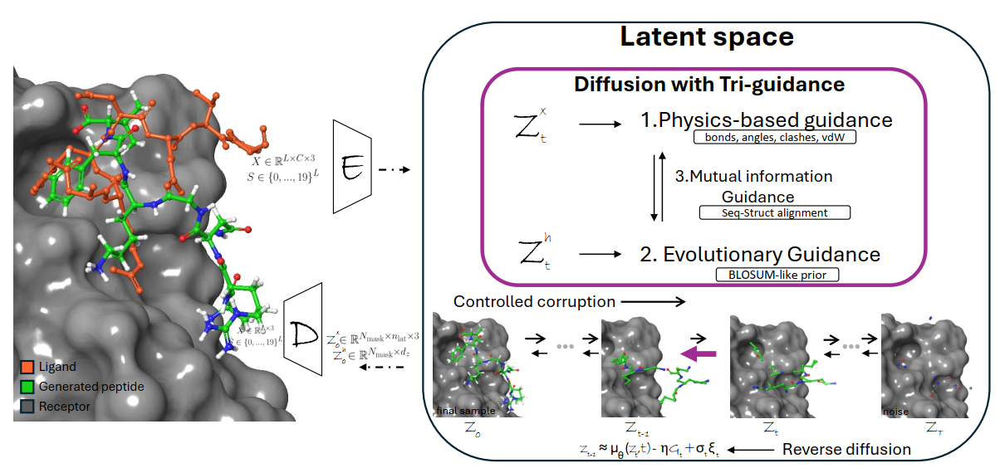

PEPTRI: TRI-GUIDED ALL-ATOM DIFFUSION FOR PEPTIDE DESIGN VIA PHYSICS, EVOLUTION, AND MUTUAL INFORMATION

## Overview

PepTri is a state-of-the-art peptide design framework that combines latent diffusion models with physics-based constraints and SE3-aware geometric features. This model generates novel peptide structures with physically realistic conformations, leveraging both deep learning and molecular physics principles.



## Key Features

- **Physics-Enhanced Generation**: Incorporates bond constraints, angular geometry, torsional preferences, and non-bonded interactions
- **SE3-Aware Diffusion**: Ensures rotation and translation invariance for geometric consistency
- **Evolutionary Guidance**: Uses conservation and coevolution patterns for biologically relevant designs
- **Multi-Scale Architecture**: Two-stage training with autoencoder and latent diffusion model
- **Comprehensive Evaluation**: Built-in metrics for structure quality, diversity, and physical validity

## Requirements

### System Requirements
- Linux-based system (tested on Ubuntu)
- CUDA-capable GPU (recommended: NVIDIA GPU with 16GB+ VRAM)
- Python 3.8 or higher

### Python Dependencies
```bash
# Core dependencies
pip install torch>=1.12.0
pip install torchvision
pip install numpy
pip install scipy
pip install pyyaml
pip install tqdm
pip install pandas

# For molecular modeling
pip install biopython
pip install mdtraj  # For trajectory analysis
pip install openmm  # For force field calculations

# Optional but recommended
pip install wandb  # For experiment tracking
pip install matplotlib
pip install seaborn
```

## Installation

1. Clone the repository:
```bash
git@github.com:aigensciences/PepTRI.git
cd PepTRI
```

2. Set up the Python environment:
```bash
# Create a virtual environment (recommended)
conda env create -f environment.yml

3. Prepare your data:
   - Place your training data in the specified directory structure
   - Update paths in config files if using different locations

## Training with run_train_pepbench_physics_epoc700.sh

### Quick Start

To train the model with physics enhancement for 700 epochs:

```bash
bash run_train_pepbench_physics_epoc700.sh 0 9901 pepbench_exp 1111 1 1 700
```

### Script Parameters

The training script accepts the following parameters:

| Parameter | Position | Description | Example |
|-----------|----------|-------------|---------|
| GPU | 1 | GPU device ID(s) to use | `0` or `0,1,2` |
| PORT | 2 | Port for distributed training | `9901` |
| WDB | 3 | Experiment name/identifier | `pepbench_exp` |
| MODE | 4 | 4-digit training mode flags | `1111` |
| PHYSICS_FLAG | 5 | Enable physics constraints (1=yes, 0=no) | `1` |
| RESUME | 6 | Resume from checkpoint (1=yes, 0=no) | `1` |
| EPOCHS | 7 | Number of training epochs | `700` |

#### MODE Parameter Details

The MODE parameter is a 4-digit string where each digit controls a training stage:
- **1st digit**: Train Autoencoder (1=yes, 0=no)
- **2nd digit**: Train Latent Diffusion Model (1=yes, 0=no)
- **3rd digit**: Generate samples (1=yes, 0=no)
- **4th digit**: Run evaluation (1=yes, 0=no)

Common MODE configurations:
- `1111`: Full pipeline (train AE, train LDM, generate, evaluate)
- `0100`: Train LDM only (assumes AE already trained)
- `0011`: Generate and evaluate only (assumes models trained)
- `1100`: Train models only, no generation/evaluation

### Training Examples

#### Example 1: Full Training Pipeline with Physics
```bash
# Train everything from scratch with physics enhancement
bash run_train_pepbench_physics_epoc700.sh 0 9901 my_experiment 1111 1 0 700
```

#### Example 2: Resume Training
```bash
# Resume training from the last checkpoint
bash run_train_pepbench_physics_epoc700.sh 0 9901 my_experiment 0100 1 1 700
```

#### Example 3: Multi-GPU Training
```bash
# Use GPUs 0, 1, and 2
bash run_train_pepbench_physics_epoc700.sh 0,1,2 9901 my_experiment 1111 1 0 700
```

#### Example 4: Baseline Model (No Physics)
```bash
# Train baseline model without physics constraints
bash run_train_pepbench_physics_epoc700.sh 0 9901 baseline_exp 1111 0 0 700
```

## Model Architecture

### Stage 1: Autoencoder
- **Architecture**: Residual convolutional autoencoder with EMA updates
- **Purpose**: Learn efficient latent representations of peptide structures
- **Config**: `scripts/configs/pepbench/autoencoder/train_codesign_res_ema.yaml`

### Stage 2: Latent Diffusion Model (LDM)
- **Architecture**: Denoising diffusion model in latent space
- **Features**:
  - SE3-aware geometric features (17-dimensional)
  - Physics-based loss functions
  - Evolutionary guidance
- **Config**: `scripts/configs/pepbench/ldm/train_codesign.yaml`

### Physics Constraints

The model incorporates multiple physics-based constraints:

1. **Structural Constraints**:
   - Bond lengths (CA-CA distance: 3.8Å ± 0.25Å)
   - Bond angles (ideal: 109.5° ± 18°)
   - Torsional preferences (Ramachandran)

2. **Non-bonded Interactions**:
   - Van der Waals forces
   - Electrostatic interactions
   - Hydrogen bonding

3. **Geometric Features**:
   - Clash prevention (min distance: 2.1Å)
   - Secondary structure preferences
   - Solvent accessibility

## Output Structure

Training outputs are organized as follows:

```
exps/
└── your_experiment_name/
    ├── AE/                      # Autoencoder checkpoints
    │   └── version_0/
    │       ├── checkpoint/
    │       └── train_config.yaml
    ├── LDM_700/                 # LDM checkpoints
    │   └── version_0/
    │       ├── checkpoint/
    │       ├── results/
    │       │   └── results.jsonl
    │       └── train_config.yaml
    └── output.log               # Training log
```

## Evaluation Metrics

The pipeline automatically evaluates generated peptides using:

- **RMSD**: Root Mean Square Deviation from reference structures
- **TM-Score**: Template Modeling score for structural similarity
- **DockQ**: Docking quality assessment
- **Diversity Metrics**: Structural and sequence diversity
- **Physics Validation**: Bond geometry, clash detection
- **ΔG Calculation**: Binding free energy estimation (40 samples)

## Monitoring Training

Monitor training progress through:

1. **Log file**: Check `exps/your_experiment/output.log`
2. **Checkpoints**: Best models saved in `checkpoint/topk_map.txt`
3. **Validation metrics**: Evaluated every 10 epochs (configurable)

## Customization

### Modifying Training Parameters

Edit configuration files in `scripts/configs/pepbench/`:
- Batch size: Modify `dataloader.batch_size`
- Learning rate: Adjust `trainer.config.optimizer.lr`
- Physics weights: Tune parameters in `model.physics_config`

### Data Configuration

Update data paths in config files:
```yaml
dataset:
  train:
    mmap_dir: /path/to/your/data/processed
    specify_index: /path/to/your/train_index.txt
```

## Troubleshooting

### Common Issues

1. **Out of Memory**: Reduce batch size or use gradient accumulation
2. **Slow Training**: Enable multi-GPU training or reduce model complexity
3. **Poor Convergence**: Adjust learning rate or physics loss weights
4. **Checkpoint Not Found**: Ensure previous training completed successfully


## Acknowledgments
- PepGLAD https://github.com/THUNLP-MT/PepGLAD for an amazing backbone network
- PepBench dataset for training and evaluation
- OpenMM for molecular force field calculations
- PyTorch team for the deep learning framework

<p align="center">
  
</p>

